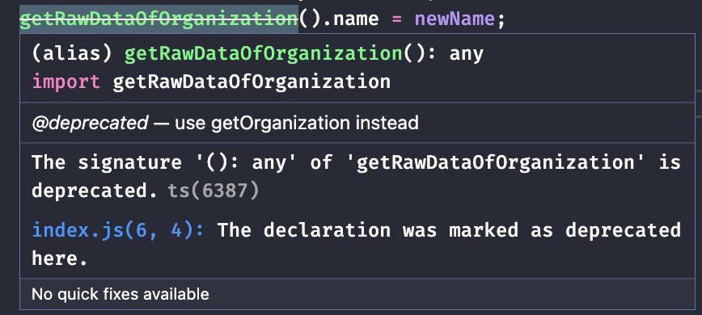

[](https://github.com/kaiosilveira/encapsulate-record-refactoring/actions/workflows/ci.yml)

ℹ️ _This repository is part of my Refactoring catalog based on Fowler's book with the same title. Please see [kaiosilveira/refactoring](https://github.com/kaiosilveira/refactoring) for more details._

---

# Encapsulate Record

**Formerly: Replace Record with Data Class**

<table>
<thead>
<th>Before</th>
<th>After</th>
</thead>
<tbody>
<tr>
<td>

```javascript
const organization = { name: 'Acme Gooseberries', country: 'GB' };
```

</td>

<td>

```javascript
export class Organization {
  constructor(data) {
    this._name = data.name;
    this._country = data.country;
  }

  set name(aString) {
    this._name = aString;
  }

  get name() {
    return this._name;
  }

  get country() {
    return this._country;
  }

  set country(arg) {
    this._country = arg;
  }
}
```

</td>
</tr>
</tbody>
</table>

Encapsulation is one of the core concepts of Object-Oriented Programming and is often related to well-modularized code. With encapsulation, we are in full control of our data structures, being sure that any changes to it will have to go through its wrapper, allowing for expansion and gradual modification and deprecation. When working with a data record, it is often easy to loose sight of how it's being accessed and mofidied throughout our application. This refactoring suggests a solution to this problem and provide a step-by-step buide on how to encapsulate our existing raw data records.

## Working examples

We're going to discuss two working examples here: a simple case, with a shallow data record, and a more complicated case, with a nested record.

### Simple case

The simple case consists of a shallow `organization` POJO (Plain Old Javascript Object). We're going to encapsulate it in a class and update its callers to consume the new structure. We start with the following code:

```javascript
const organization = { name: 'Acme Gooseberries', country: 'GB' };
```

#### Test suite

To make sure each step of our refactoring session won't break anything, unit tests were put in place for the fictional clients of our `organization` object. They're extremely simple and only validate the resulting output of each client module:

Client 1:

```javascript
describe('client1', () => {
  it('should create a header using the organization name', () => {
    expect(result).toBe('<h1>Acme Gooseberries</h1>');
  });
});
```

Client 2:

```javascript
describe('client2', () => {
  it('should update the organization name', () => {
    expect(result).toBe('Metamorphosis Inc');
  });
});
```

This is all we need to get started.

#### Steps

Our first refactoring step is encapsulating our `organization` variable into a function and updating the callers accordingly, so our changes are centralized.

```diff
diff --git a/src/client1/index.js b/src/client1/index.js
@@ -1,3 +1,3 @@
-import { organization } from '../index.js';
+import { getRawDataOfOrganization } from '../index.js';

-export const result = `<h1>${organization.name}</h1>`;
+export const result = `<h1>${getRawDataOfOrganization().name}</h1>`;

diff --git a/src/client2/index.js b/src/client2/index.js
@@ -1,6 +1,6 @@
-import { organization } from '../index.js';
+import { getRawDataOfOrganization } from '../index.js';

 const newName = 'Metamorphosis Inc';
-organization.name = newName;
+getRawDataOfOrganization().name = newName;

-export const result = organization.name;
+export const result = getRawDataOfOrganization().name;

diff --git a/src/index.js b/src/index.js
@@ -1 +1,5 @@
 export const organization = { name: 'Acme Gooseberries', country: 'GB' };
+
+export function getRawDataOfOrganization() {
+  return organization;
+}
```

We will also need to introduce an `Organization` class. Our goal is to have all the accesses to `organization` going through this class.

```diff
diff --git a/src/organization.js b/src/organization.js
+++ b/src/organization.js
@@ -0,0 +1,5 @@
+export class Organization {
+  constructor(data) {
+    this._data = data;
+  }
+}
```

With the class in place, we can replace our `organization` record with a class instance, updating its wrapper function. We'll also introduce a method called `getOrganization` to provide a way to access the full class instance instead of only its raw data.

```diff
diff --git a/src/index.js b/src/index.js
@@ -1,5 +1,14 @@
-export const organization = { name: 'Acme Gooseberries', country: 'GB' };
+import { Organization } from './organization';

+export const organization = new Organization({ name: 'Acme Gooseberries', country: 'GB' });
+
+/**
+ * @deprecated use getOrganization instead
+ */
 export function getRawDataOfOrganization() {
+  return organization._data;
+}
+
+export function getOrganization() {
   return organization;
 }
```

We can also mark our `getRawDataOfOrganization` as deprecated, as our goal is to move clients to the new function:



Clients will see the function with a strikethrought line now, which is a good visual effect to discourage people of using it:


Now, we need a getter and a setter for our `name` field, since it's being accessed and modified externally.

```diff
diff --git a/src/organization.js b/src/organization.js
@@ -2,4 +2,12 @@
export class Organization {
   constructor(data) {
     this._data = data;
   }
+
+  set name(aString) {
+    this._data.name = aString;
+  }
+
+  get name() {
+    return this._data.name;
+  }
 }
```

Moving on, we need to update the clients to use class variation of the `organization`:

```diff
diff --git a/src/client1/index.js b/src/client1/index.js
@@ -1,3 +1,3 @@
-import { getRawDataOfOrganization } from '../index.js';
+import { getOrganization } from '../index.js';

-export const result = `<h1>${getRawDataOfOrganization().name}</h1>`;
+export const result = `<h1>${getOrganization().name}</h1>`;

diff --git a/src/client2/index.js b/src/client2/index.js
@@ -1,6 +1,7 @@
-import { getRawDataOfOrganization } from '../index.js';
+import { getOrganization } from '../index.js';

 const newName = 'Metamorphosis Inc';
-getRawDataOfOrganization().name = newName;

-export const result = getRawDataOfOrganization().name;
+getOrganization().name = newName;
+
+export const result = getOrganization().name;
```

And then we can remove the deprecated (and now unused) `getRawDataOfOrganization` function:

```diff
diff --git a/src/index.js b/src/index.js
@@ -2,13 +2,6 @@ import { Organization } from './organization';

 export const organization = new Organization({ name: 'Acme Gooseberries', country: 'GB' });

-/**
- * @deprecated use getOrganization instead
- */
-export function getRawDataOfOrganization() {
-  return organization._data;
-}
-
 export function getOrganization() {
   return organization;
 }
```

Finally, we can fold our data object into class instance fields at `Organization` class, so our internal representation is more concise:

```diff
diff --git a/src/organization.js b/src/organization.js
@@ -1,13 +1,14 @@
 export class Organization {
   constructor(data) {
-    this._data = data;
+    this._name = data.name;
+    this._country = data.country;
   }

   set name(aString) {
-    this._data.name = aString;
+    this._name = aString;
   }

   get name() {
-    return this._data.name;
+    return this._name;
   }
 }
```

And that's it! Now all access to our `organizaton` object will go through our `Organization` class.

#### Commit history

Below there's the commit history for the steps detailed above.

| Commit SHA                                                                                                                | Message                                                           |
| ------------------------------------------------------------------------------------------------------------------------- | ----------------------------------------------------------------- |
| [9ffaf23](https://github.com/kaiosilveira/encapsulate-record-refactoring/commit/9ffaf23b552026e795891af7f5c17920c077419a) | encapsulate organization variable using a function                |
| [6f8588c](https://github.com/kaiosilveira/encapsulate-record-refactoring/commit/6f8588c16e7739a627329ab32d598f17324bf91c) | introduce Organization class                                      |
| [f5f48e0](https://github.com/kaiosilveira/encapsulate-record-refactoring/commit/f5f48e00909080b38c01998f83876275a972a053) | replace raw organization record with a class instance             |
| [b61a76d](https://github.com/kaiosilveira/encapsulate-record-refactoring/commit/b61a76dfeea467ceaa2b2be336534048db19fdaa) | introduce getter and setter for name at Organization class        |
| [a24103a](https://github.com/kaiosilveira/encapsulate-record-refactoring/commit/a24103ae66666f2c99f0e1f55981a714d9330179) | update clients to use class variation of organization getter      |
| [61664b0](https://github.com/kaiosilveira/encapsulate-record-refactoring/commit/61664b0a859d94a7dae04fa5b680366da7631cf2) | remove deprecated and unused getRawDataOfOrganization function    |
| [1836e62](https://github.com/kaiosilveira/encapsulate-record-refactoring/commit/1836e62c2bb78ea213840971bb84bf7a212bbe03) | fold data object into class instance fields at Organization class |

For the full commit history for this project, check the [Commit History tab](https://github.com/kaiosilveira/encapsulate-record-refactoring/commits/main).

### Nested record

To perform this refactoring in a nested record, the core steps still apply: encapsulating the record and providing accessor functions for clients to interact with it is the way to go. We need to be careful, though, when dealing with updates, as we can end up allowing our encapsulation to leak. Our starting point is the following code:

```javascript
// customer-data.js
const customerData = {
  1920: {
    name: 'kaio',
    id: '1920',
    usages: {
      2016: {
        1: 50,
        2: 55,
        3: 55,
        4: 55,
        5: 55,
        6: 55,
        7: 55,
        8: 55,
        9: 55,
        10: 55,
        11: 55,
        12: 55,
      },
      2015: {
        /* all the months */
      },
    },
  },
  38673: {
    name: 'Margaret',
    id: '38673',
    usages: {
      2016: {
        /* all the months */
      },
      2015: {
        /* all the months */
      },
    },
  },
};

// reader.js (a client that reads the data to perform some computation)
export function compareUsage(customerID, laterYear, month) {
  const later = customerData[customerID].usages[laterYear][month];
  const earlier = customerData[customerID].usages[[laterYear - 1]][month];
  return { laterAmount: later, change: later - earlier };
}

// updater.js (a client that updates the data)
export function updateCustomerData() {
  customerData['1920'].usages['2016']['1'] = 42;
}
```

### Test suite

A simple test suite was put in place to make sure our clients remain consistent throughout the refactoring steps. The tests are described below.

```javascript
// compare-usage.test.js
describe('compareUsage', () => {
  it("should compare a client's usage between a given year and a previous one", () => {
    expect(compareUsage('1920', 2016, 1)).toEqual({ change: -20, laterAmount: 50 });
  });
});

// updater.js
describe('updater', () => {
  it('should update the customer data', () => {
    updateCustomerData();
    expect(customerData['1920'].usages['2016']['1']).toEqual(42);
  });
});
```

Of course, the tests and the code in the clients themselves are rather simplistic, so we can stay focused on the refactoring steps.

### Steps

We start the same way: exposing functions that encpasulate the raw data, providing a seam for further improvements.

```diff
diff --git a/src/nested-record/customer-data.js b/src/nested-record/customer-data.js
@@ -68,3 +68,11 @@ export const customerData = {
     }
   },
 };
+
+export function getRawDataOfCustomers() {
+  return customerData;
+}
+
+export function setRawDataOfCustomers(arg) {
+  customerData = arg;
+}
```

With that in place, we can update our customers to use the accessors instead of the `customerData` POJO:

```diff
diff --git a/src/nested-record/reader/index.js b/src/nested-record/reader/index.js
@@ -1,7 +1,7 @@
-import { customerData } from "../customer-data";
+import { getRawDataOfCustomers } from "../customer-data";

 export function compareUsage(customerID, laterYear, month) {
-  const later = customerData[customerID].usages[laterYear][month];
-  const earlier = customerData[customerID].usages[[laterYear - 1]][month];
+  const later = getRawDataOfCustomers()[customerID].usages[laterYear][month];
+  const earlier = getRawDataOfCustomers()[customerID].usages[[laterYear - 1]][month];
   return { laterAmount: later, change: later - earlier };
 }

diff --git a/src/nested-record/updater/index.js b/src/nested-record/updater/index.js
@@ -1,5 +1,5 @@
-import { customerData } from '../customer-data';
+import { getRawDataOfCustomers } from '../customer-data';

 export function updateCustomerData() {
-  customerData['1920'].usages['2016']['1'] = 42;
+  getRawDataOfCustomers()['1920'].usages['2016']['1'] = 42;
 }
```

Moving forward, we can now start implemeting our `CustomerData` class:

```diff

diff --git a/src/nested-record/customer-data.js b/src/nested-record/customer-data.js
@@ -1,3 +1,9 @@
+class CustomerData {
+  constructor(data) {
+    this._data = data;
+  }
+}
+
 export const customerData = {
   '1920': {
     name: 'kaio',

```

Then, we can update the `customer-data` module to encapsulate the data record into the class and update the clients:

```diff
diff --git a/src/nested-record/customer-data.js b/src/nested-record/customer-data.js
@@ -4,7 +4,7 @@ class CustomerData {
   }
 }

-export const customerData = {
+export const customerData = new CustomerData({
   '1920': {
     name: 'kaio',
     id: '1920',
@@ -73,12 +73,16 @@ export const customerData = {
       },
     }
   },
-};
+});

-export function getRawDataOfCustomers() {
+export function getCustomerData() {
   return customerData;
 }

+export function getRawDataOfCustomers() {
+  return customerData._data;
+}
+
 export function setRawDataOfCustomers(arg) {
-  customerData = arg;
+  customerData = new CustomerData(arg);
 }

diff --git a/src/nested-record/updater/index.test.js b/src/nested-record/updater/index.test.js
@@ -4,6 +4,6 @@ import { customerData } from '../customer-data';
 describe('updater', () => {
   it('should update the customer data', () => {
     updateCustomerData();
-    expect(customerData['1920'].usages['2016']['1']).toEqual(42);
+    expect(customerData._data['1920'].usages['2016']['1']).toEqual(42);
   });
 });
```

Now we can introduce a setter to allow for updates of the customer data:

```diff

diff --git a/src/nested-record/customer-data.js b/src/nested-record/customer-data.js
@@ -86,3 +86,7 @@ export function getRawDataOfCustomers() {
 export function setRawDataOfCustomers(arg) {
   customerData = new CustomerData(arg);
 }
+
+export function setusage(customerID, year, month, amount) {
+  getRawDataOfCustomers()[customerID].usages[year][month] = amount;
+}
```

and also update the clients to use the new setter:

```diff

diff --git a/src/nested-record/customer-data.js b/src/nested-record/customer-data.js
@@ -87,6 +87,6 @@ export function setRawDataOfCustomers(arg) {
   customerData = new CustomerData(arg);
 }

-export function setusage(customerID, year, month, amount) {
+export function setUsage(customerID, year, month, amount) {
   getRawDataOfCustomers()[customerID].usages[year][month] = amount;
 }
diff --git a/src/nested-record/updater/index.js b/src/nested-record/updater/index.js
@@ -1,5 +1,5 @@
-import { getRawDataOfCustomers } from '../customer-data';
+import { setUsage } from '../customer-data';

 export function updateCustomerData() {
-  getRawDataOfCustomers()['1920'].usages['2016']['1'] = 42;
+  setUsage('1920', '2016', '1', 42);
 }

```

Finally, we can move the `setUsage` function into `CustomerData` class:

```diff
diff --git a/src/nested-record/customer-data.js b/src/nested-record/customer-data.js
@@ -2,6 +2,10 @@ class CustomerData {
   constructor(data) {
     this._data = data;
   }
+
+  setUsage(customerID, year, month, amount) {
+    this._data[customerID].usages[year][month] = amount;
+  }
 }

 export const customerData = new CustomerData({
diff --git a/src/nested-record/updater/index.js b/src/nested-record/updater/index.js
@@ -1,5 +1,5 @@
-import { setUsage } from '../customer-data';
+import { getCustomerData } from '../customer-data';

 export function updateCustomerData() {
-  setUsage('1920', '2016', '1', 42);
+  getCustomerData().setUsage('1920', '2016', '1', 42);
 }

```

Now that all the access to the `customerData` record is encapsulated, to make sure all the clients are going through our data accessor functions, we can introduce a `rawData` getter in the `CustomerData`. To do so, we can use lodash's `cloneDeep` utility. But before that we need to install it:

```diff
diff --git a/package.json b/package.json
@@ -11,5 +11,8 @@
   },
   "devDependencies": {
     "jest": "^29.0.3"
+  },
+  "dependencies": {
+    "lodash": "^4.17.21"
   }
 }
diff --git a/yarn.lock b/yarn.lock
index d6b725b..046f428 100644
--- a/yarn.lock
+++ b/yarn.lock
@@ -1646,6 +1646,11 @@ locate-path@^5.0.0:
   dependencies:
     p-locate "^4.1.0"

+lodash@^4.17.21:
+  version "4.17.21"
+  resolved "https://registry.yarnpkg.com/lodash/-/lodash-4.17.21.tgz#679591c564c3bffaae8454cf0b3df370c3d6911c"
+  integrity sha512-v2kDEe57lecTulaDIuNTPy3Ry4gLGJ6Z1O3vE1krgXZNrsQ+LFTGHVxVjcXPs17LhbZVGedAJv8XZ1tvj5FvSg==
+
 lru-cache@^5.1.1:
   version "5.1.1"
   resolved "https://registry.yarnpkg.com/lru-cache/-/lru-cache-5.1.1.tgz#1da27e6710271947695daf6848e847f01d84b920"
```

Now, we can expose the method to return its raw data:

```diff
diff --git a/src/nested-record/customer-data.js b/src/nested-record/customer-data.js
@@ -1,8 +1,14 @@
+import _ from 'lodash';
+
 class CustomerData {
   constructor(data) {
     this._data = data;
   }

+  get rawData() {
+    return _.cloneDeep(this._data);
+  }
+
   setUsage(customerID, year, month, amount) {
     this._data[customerID].usages[year][month] = amount;
   }
@@ -84,7 +90,7 @@ export function getCustomerData() {
 }

 export function getRawDataOfCustomers() {
-  return customerData._data;
+  return customerData.rawData;
 }

 export function setRawDataOfCustomers(arg) {
```

and update the clients of `CustomerData` to use the encapsulated version of the data:

```diff
diff --git a/src/nested-record/reader/index.js b/src/nested-record/reader/index.js
@@ -1,7 +1,7 @@
-import { getRawDataOfCustomers } from "../customer-data";
+import { getCustomerData } from "../customer-data";

 export function compareUsage(customerID, laterYear, month) {
-  const later = getRawDataOfCustomers()[customerID].usages[laterYear][month];
-  const earlier = getRawDataOfCustomers()[customerID].usages[[laterYear - 1]][month];
+  const later = getCustomerData().rawData[customerID].usages[laterYear][month];
+  const earlier = getCustomerData().rawData[customerID].usages[[laterYear - 1]][month];
   return { laterAmount: later, change: later - earlier };
 }
```

Finally, we can remove the now unused customer-data accessor functions:

```diff

diff --git a/src/nested-record/customer-data.js b/src/nested-record/customer-data.js
@@ -88,15 +88,3 @@ export const customerData = new CustomerData({
 export function getCustomerData() {
   return customerData;
 }
-
-export function getRawDataOfCustomers() {
-  return customerData.rawData;
-}
-
-export function setRawDataOfCustomers(arg) {
-  customerData = new CustomerData(arg);
-}
-
-export function setUsage(customerID, year, month, amount) {
-  getRawDataOfCustomers()[customerID].usages[year][month] = amount;
-}
```

And that's it, wer're done with this refactoring! Of course, there is still a lot of room for improvements and some tradeoffs were made, but the core idea remains the same: isolating what varies so we can have control over the data.

### Commit history

The commit history of the steps taken above are described below.

| Commit SHA                                                                                                                | Message                                                                               |
| ------------------------------------------------------------------------------------------------------------------------- | ------------------------------------------------------------------------------------- |
| [765f197](https://github.com/kaiosilveira/encapsulate-record-refactoring/commit/765f19711f9f18811ba6225e183fa4e45cb2008c) | encapsulate customer data into functions                                              |
| [657efe5](https://github.com/kaiosilveira/encapsulate-record-refactoring/commit/657efe5de07b5dd334fe0c7525e198bf7d2cfdbc) | update customer-data clients to use accessor functions instead of the raw data record |
| [b798dfa](https://github.com/kaiosilveira/encapsulate-record-refactoring/commit/b798dfa4ed8c5151905d7763df4b5ed15ac9b4e1) | introduce CustomerData class                                                          |
| [eb82260](https://github.com/kaiosilveira/encapsulate-record-refactoring/commit/eb82260f6839d4fcba3033706af064e2790e4bb3) | update customer-data module to encapsulate the data record into the class             |
| [1857d6f](https://github.com/kaiosilveira/encapsulate-record-refactoring/commit/1857d6f6be882e10e62da0cc982aaaab45dc69d1) | introduce getter to update customer data                                              |
| [5e3bcd4](https://github.com/kaiosilveira/encapsulate-record-refactoring/commit/5e3bcd4f77a1227601d9e3f1f5452bb7f5d41819) | update customer-data clients to use new setter                                        |
| [7cf559b](https://github.com/kaiosilveira/encapsulate-record-refactoring/commit/7cf559bbd608b36b308acfd6302df8d57a3d216f) | move setUsage function into CustomerData class                                        |
| [b752202](https://github.com/kaiosilveira/encapsulate-record-refactoring/commit/b7522029ae772d5240afb43b84297c55c97c9f66) | add lodash                                                                            |
| [1076ffe](https://github.com/kaiosilveira/encapsulate-record-refactoring/commit/1076ffe5ad9485107a0bd3f4b731fd75efaad19f) | expose a setter at CustomerData class to return its raw data                          |
| [9799bb3](https://github.com/kaiosilveira/encapsulate-record-refactoring/commit/9799bb37bbea47f9a341f30fee0ffbd41e85c02f) | update clients of CustomerData to use the encapsulated version of the data            |
| [6042d00](https://github.com/kaiosilveira/encapsulate-record-refactoring/commit/6042d009e1d5ab1de010fcec78153c9dcfb32237) | remove unused customer-data accessors                                                 |

For the full commit history for this project, check the [Commit History tab](https://github.com/kaiosilveira/encapsulate-record-refactoring/commits/main).
